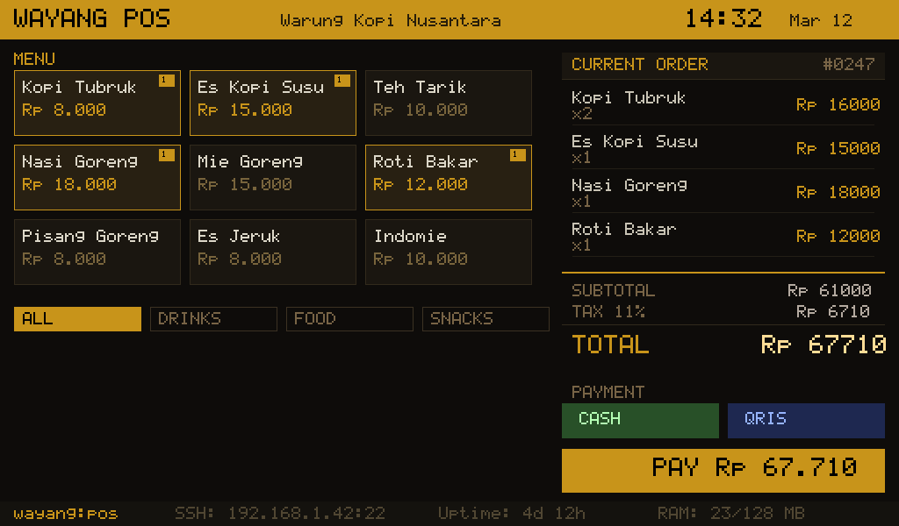

# ꦮꦪꦁ Wayang POS

Lightweight Point of Sale kiosk app for [WayangOS](https://wayangos.pages.dev). Renders directly to framebuffer via SDL2 — no X11, no Wayland, no desktop environment.



## Specs

- **Binary size:** ~3 MB (static linked)
- **RAM usage:** ~23 MB at runtime
- **Dependencies:** None (static binary, drop it in and run)
- **Display:** SDL2 framebuffer (fbdev or KMS/DRM)
- **Resolution:** 1024x600 (scales to display)

## Features

- Menu grid with category tabs (ALL / DRINKS / FOOD / SNACKS)
- Order management with quantity tracking
- Tax calculation (configurable %)
- Payment methods: Cash + QRIS
- Status bar: hostname, SSH address, uptime, RAM
- Gold-on-black theme matching WayangOS aesthetic

## Build

Requires SDL2 development libraries.

### On WayangOS (cross-compile from any Linux host)

```bash
# Build SDL2 static
wget https://github.com/libsdl-org/SDL/releases/download/release-2.30.10/SDL2-2.30.10.tar.gz
tar xzf SDL2-2.30.10.tar.gz && cd SDL2-2.30.10
mkdir build && cd build
cmake .. -DSDL_SHARED=OFF -DSDL_STATIC=ON -DSDL_X11=OFF -DSDL_WAYLAND=OFF \
    -DSDL_KMSDRM=ON -DSDL_OPENGL=OFF -DSDL_VULKAN=OFF -DSDL_PULSEAUDIO=OFF \
    -DSDL_ALSA=OFF -DCMAKE_INSTALL_PREFIX=../../sdl2
make -j$(nproc) && make install
cd ../..

# Build Wayang POS (static)
gcc -Os -static -o wayang-pos pos.c \
    -Isdl2/include -Lsdl2/lib \
    -lSDL2 -ldrm -lm -lpthread -ldl -lrt
strip wayang-pos
```

### On Ubuntu/Debian (quick test)

```bash
sudo apt install libsdl2-dev
gcc -Os -o wayang-pos pos.c $(sdl2-config --cflags --libs)
```

## Deploy to WayangOS

```bash
# Copy to device
scp wayang-pos root@wayang:/usr/bin/

# Run manually
ssh root@wayang 'SDL_VIDEODRIVER=fbdev /usr/bin/wayang-pos'

# Auto-start on boot
ssh root@wayang 'echo "SDL_VIDEODRIVER=fbdev /usr/bin/wayang-pos &" >> /etc/init.d/rcS'
```

## Customize

This is a **demo/template**. Fork it and build your own kiosk app:

- Edit menu items in the `items[]` array
- Change tax rate in the total calculation
- Add your own business name in the header
- Wire up actual payment logic
- Add receipt printing, inventory tracking, etc.

The point: you don't need Electron, a browser, or a desktop environment to build a kiosk app. Just C + SDL2 + framebuffer.

## Use as a Template

This repo demonstrates how to build lightweight GUI apps for WayangOS:

1. **Render with SDL2** — works on any framebuffer
2. **Static link everything** — no runtime dependencies
3. **Deploy via scp** — that's your package manager
4. **Auto-start via init.d** — boots straight into your app

## License

MIT
